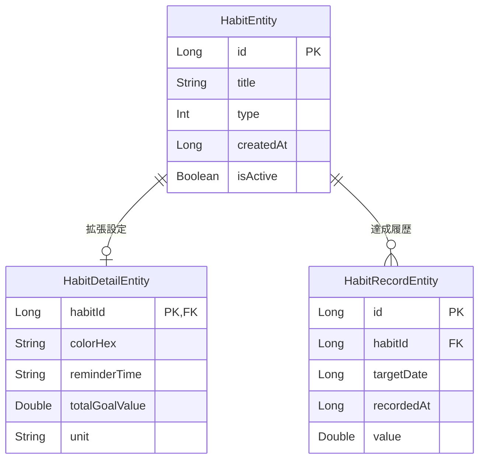

### ER図

```mermaid
erDiagram
    HabitEntity ||--o| HabitDetailEntity: "拡張設定"
    HabitEntity ||--o{ HabitRecordEntity: "達成履歴"

    HabitEntity {
        Long id PK
        String title
        Int type
        Long createdAt
        Boolean isActive
    }

    HabitDetailEntity {
        Long habitId PK, FK
        String colorHex
        String reminderTime
        Double totalGoalValue
        String unit
    }

    HabitRecordEntity {
        Long id PK
        Long habitId FK
        Long targetDate
        Long recordedAt
        Double value
    }
```