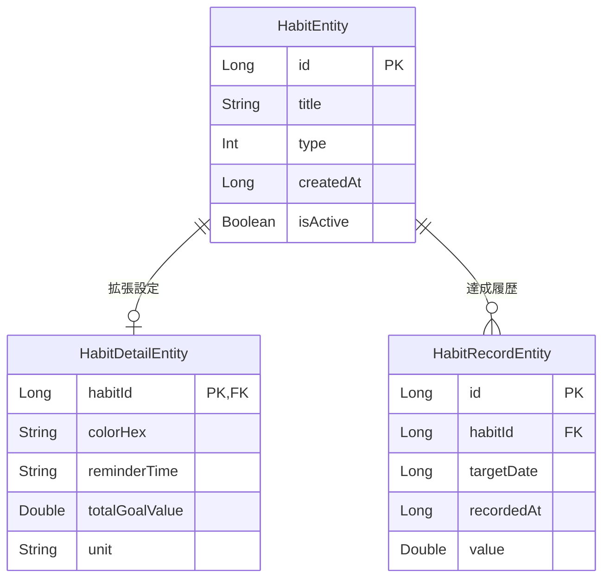

# アプリ設計書：ゆらり (Habit Wave)

## 1. コンセプト

「完璧主義を捨て、ゆらゆらと習慣を続ける」ための習慣トラッカー。

最大の特徴は、**「昨日の分も今日記録できる(イエスタデイ・チェックイン)」**
機能により、1日の失敗でストリーク(継続)が途切れる絶望感を軽減すること。

---

## 2. 技術スタック

- **UI**: Jetpack Compose (Material 3)
- **Architecture**: Android 推奨アーキテクチャ (UI層 - ドメイン層 - データ層)
- **DI**: Dagger Hilt
- **Database**: Room (SQLite)
- **Async**: Kotlin Coroutines / Flow

---

## 3. パッケージ構成

```
io.github.kazakumo.habitwave
 ├─ data
 │   ├─ local
 │   │   └─ database
 │   │       ├─ dao        (HabitDao: DB操作)
 │   │       ├─ entity     (HabitEntity, HabitDetailEntity, HabitRecordEntity)
 │   │       └─ relations  (HabitWithRecords: 3テーブルを統合した型)
 │   └─ repository         (HabitRepositoryImpl: データ層のエントリポイント)
 ├─ domain
 │   ├─ model              (Habit: UIで扱う純粋なモデル)
 │   └─ repository         (HabitRepository: インターフェース)
 ├─ ui
 │   ├─ habit
 │   │   ├─ HabitViewModel (画面の状態管理)
 │   │   ├─ HabitScreen    (メイン画面)
 │   │   └─ components     (HabitItem, AddHabitDialog)
 │   └─ theme              (Composeのテーマ設定)
 └─ di                     (HiltのModule)
```

---

## 4. データモデル設計

### A. DBエンティティ(Data層)

| テーブル名                 | 役割      | 主要カラム                                     |
|-----------------------|---------|-------------------------------------------|
| **HabitEntity**       | 習慣の基本情報 | `id`, `title`, `createdAt`                |
| **HabitDetailEntity** | 習慣のメタ情報 | `habitId`, `colorHex`                     |
| **HabitRecordEntity** | 達成記録    | `habitId`, `targetDate` (Long型: yyyyMMdd) |

### B. ドメインモデル(UI層用)

**`Habit` クラス**：DBの複雑な関係を解きほぐし、1つの習慣に必要な「タイトル」「色」「今日の達成状況」「昨日の達成状況」「現在の継続日数」をまとめたもの。

---

## 5. 主要ロジック

### イエスタデイ・チェックイン (YC)

- UIから `LocalDate.now().minusDays(1)` を引数にリポジトリを叩くことで、昨日の日付の
  `HabitRecordEntity` を作成・削除する。

### ストリーク(継続日数)計算

- `zipWithNext` と `takeWhile` を使用した関数型スタイル。
- 「今日」または「昨日」に記録がある場合、そこから1日ずつ遡り、記録が連続している間だけカウントを増やす。

---

## 6. データの流れ (Data Flow)

1. **Room**: `HabitDao` がデータベースから `Flow<List<HabitWithRecords>>` を取得。
2. **Repository**: `HabitWithRecords` (Entity) を `Habit` (Domain Model) へ変換。ここでストリーク計算や色の割当を行う。
3. **ViewModel**: `repository.getHabits()` を `StateFlow` に変換し、UIへ公開。
4. **UI (Compose)**: `uiState` を監視し、リスト表示。ユーザーの操作を ViewModel へ伝える。

---

## 7. 現在の進捗と次のタスク

- [x] データベース・エンティティ設計
- [x] リポジトリ層の実装
- [x] ストリーク計算ロジックの関数型実装
- [x] Hiltによる依存関係の注入
- [x] メイン画面(一覧)の基本UI
- [x] 習慣追加ダイアログ(色選択付き)
- [x] 習慣の削除・編集機能
- [ ] 達成時のフィードバック演出(振動・アニメーション)

---

## 💡 振り返りメモ

このアプリにおいて、`targetDate` を `Long (yyyyMMdd)`
で管理しているのは、日付変更やアプリ再起動に影響されず、DBクエリで高速に比較するためです。計算時は
`LocalDate` に変換することで、月跨ぎなどのカレンダー計算を安全に行っています。

### ER図

